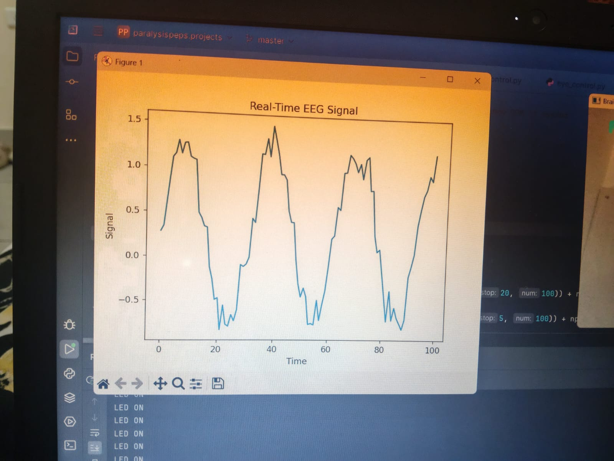
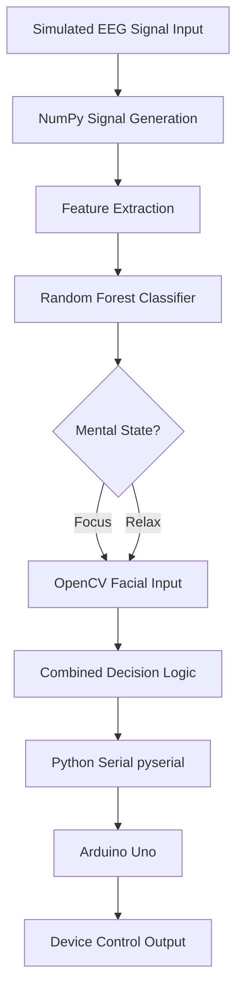

# Brain-Controlled Device (Simulated EEG + Arduino)

## Overview
This project is a simple brain-inspired control system built using Python and Arduino. It simulates EEG signals (focus vs relax), processes them using a Random Forest model.

The system also uses a webcam to detect face presence and interpret it as a basic "focus" or "relax" state.
In the part 2 project project i added LEDs and created a 'ON' and 'OFF' system with facial expression.

## How It Works

1. **EEG Simulation**
   - Generates artificial brain signals using NumPy
   - Two states:
     - Focus → high-frequency signal
     - Relax → low-frequency signal

2. **AI Model**
   - Trained using `RandomForestClassifier` from scikit-learn
   - Classifies signals into:
     - Focus (1)
     - Relax (0)

     IMAGE FOCUS 
     IMAGE RELAX 

3. **Computer Vision**
   - Uses OpenCV
   - Detects face using Haar Cascade
   - Face detected → Focus
   - No face or closed eyes → Relax

4. ** Real-Time Graph **
   - Matplotlib displays live EEG signal(simulated)
     GRAPH 

## Project Architecture

## Parameters

| Model Accuracy | 100% (simulated data) |
| Note | Signals are synthetically generated with distinct frequency profiles per class |

## Hardware Used
- Arduino UNO
- USB cable

## Software & Libraries
- Python
- NumPy
- Matplotlib
- scikit-learn (Random Forest)
- OpenCV
- pySerial
- Arduino IDE

## How to Run

### 1. Upload Arduino Code
Upload the `.ino` file to Arduino using Arduino IDE.

### 2. Install Python Libraries

pip install numpy ,matplotlib, scikit-learn ,opencv-python ,pyserial

# Controls

Press 'q' to exit the program in the web cam
  

# Features

Simulated EEG signal generation

Machine learning classification

Real-time graph visualization

Webcam-based state detection

Arduino hardware control

## Limitations

- Model achieves 100% accuracy on simulated data due to mathematically distinct signal patterns
- Real EEG data would require more complex feature extraction and lower accuracy is expected
